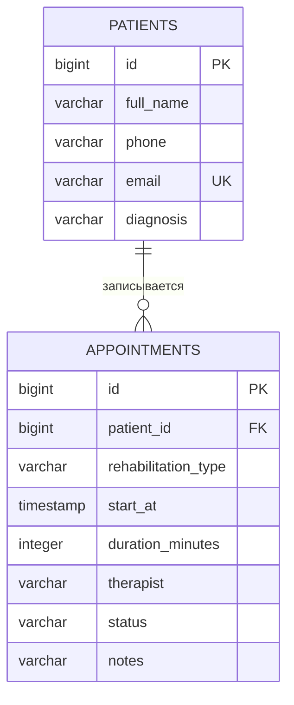

# ER-диаграмма

```mermaid
erDiagram
    PATIENTS ||--o{ APPOINTMENTS : "записывается"
    PATIENTS {
        bigint id PK
        varchar full_name
        varchar phone
        varchar email UK
        varchar diagnosis
    }
    APPOINTMENTS {
        bigint id PK
        bigint patient_id FK
        varchar rehabilitation_type
        timestamp start_at
        integer duration_minutes
        varchar therapist
        varchar status
        varchar notes
    }
```
